# The Grammar

# http://had.co.nz/ggplot2
### This HTML page and its graphics were created using knitr by taking a simple demo R script by Hadley Wickham and adding some R markdown.

```r
library(ggplot2)
```

## qplot examples 

```r
qplot(diamonds$cut, diamonds$carat)
```

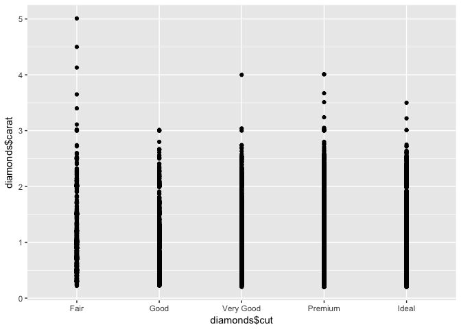<!-- -->


```r
qplot(carat, price, data = diamonds)
```

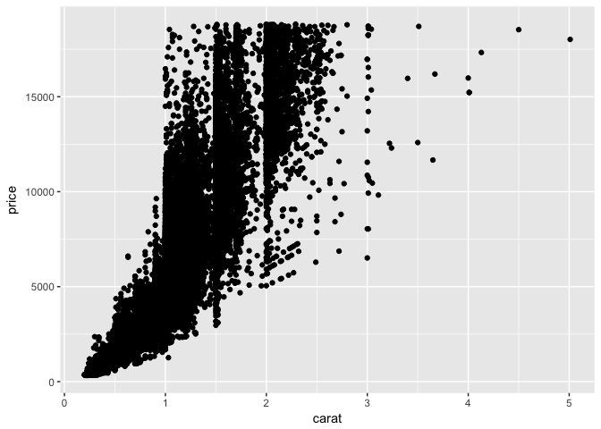<!-- -->

```r
qplot(carat, price, data = diamonds, colour=clarity)
```

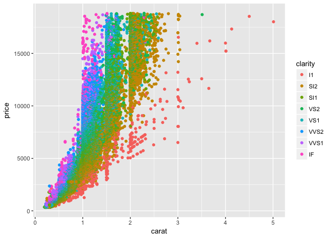<!-- -->

```r
qplot(carat, price, data = diamonds, geom=c("point", "smooth"), method=lm)
```

```
## Warning: Ignoring unknown parameters: method
```

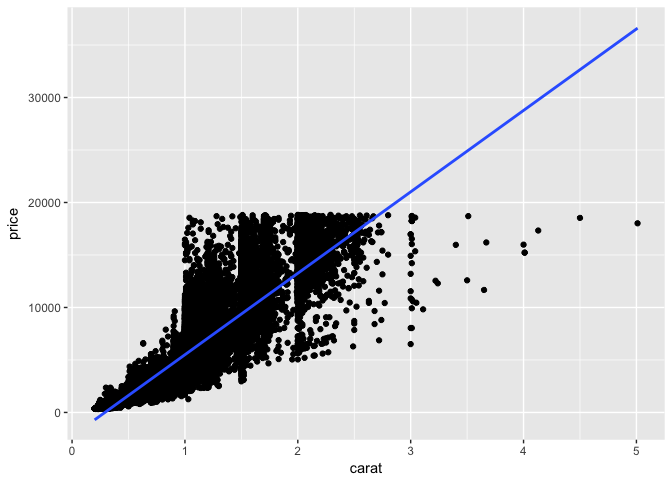<!-- -->

```r
qplot(carat, data = diamonds, geom="histogram")
```

```
## `stat_bin()` using `bins = 30`. Pick better value with `binwidth`.
```

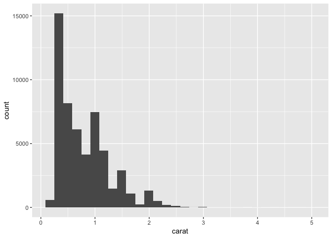<!-- -->

```r
qplot(carat, data = diamonds, geom="histogram", binwidth = 1)
```

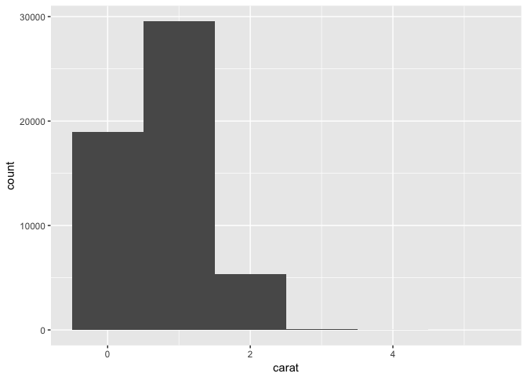<!-- -->

```r
qplot(carat, data = diamonds, geom="histogram", binwidth = 0.1)
```

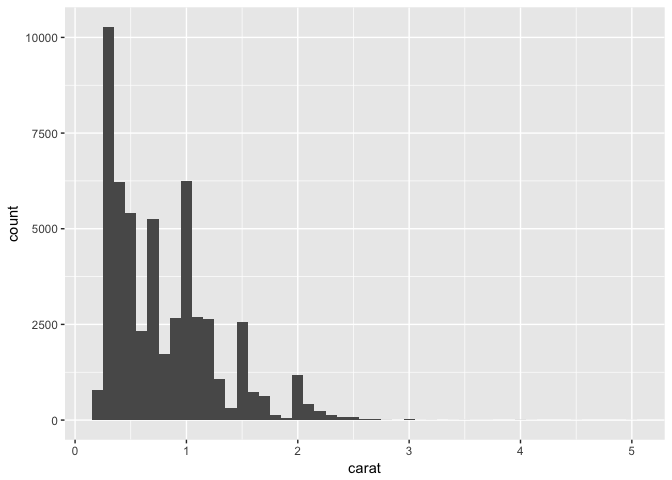<!-- -->

```r
qplot(carat, data = diamonds, geom="histogram", binwidth = 0.01)
```

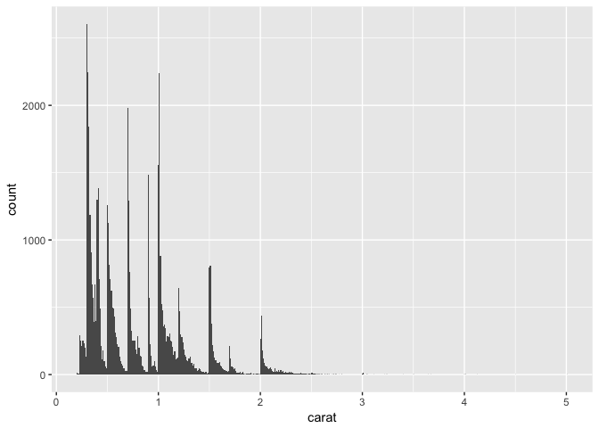<!-- -->

## using ggplot() 

```r
d <- ggplot(diamonds, aes(x=carat, y=price))
```

```r
d + geom_point()
```

<!-- -->

```r
d + geom_point(aes(colour = carat))
```

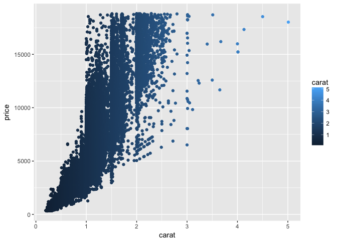<!-- -->


```r
ggplot(diamonds) + geom_histogram(aes(x=price))
```

```
## `stat_bin()` using `bins = 30`. Pick better value with `binwidth`.
```

<!-- -->

## Separation of statistcs and geometric elements

```r
p <- ggplot(diamonds, aes(x=price))
```

```r
p + geom_histogram()
```

```
## `stat_bin()` using `bins = 30`. Pick better value with `binwidth`.
```

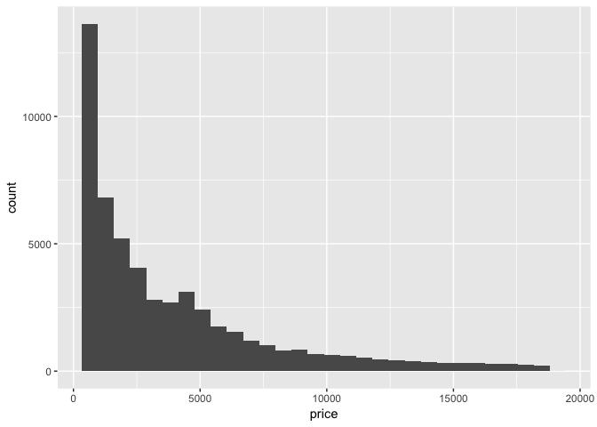<!-- -->

```r
p + stat_bin(geom="area")
```

```
## `stat_bin()` using `bins = 30`. Pick better value with `binwidth`.
```

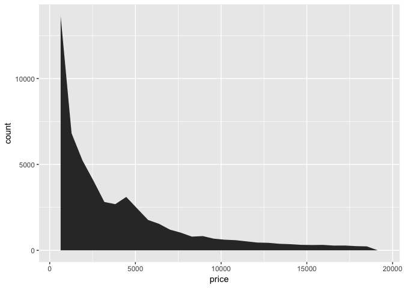<!-- -->

```r
p + stat_bin(geom="point")
```

```
## `stat_bin()` using `bins = 30`. Pick better value with `binwidth`.
```

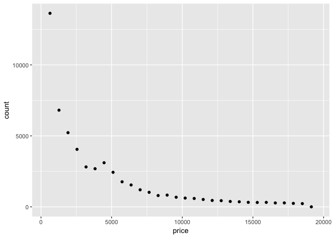<!-- -->

```r
p + stat_bin(geom="line")
```

```
## `stat_bin()` using `bins = 30`. Pick better value with `binwidth`.
```

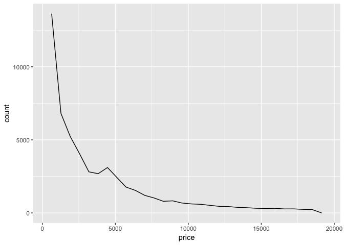<!-- -->

```r
p + geom_histogram(aes(fill = clarity))
```

```
## `stat_bin()` using `bins = 30`. Pick better value with `binwidth`.
```

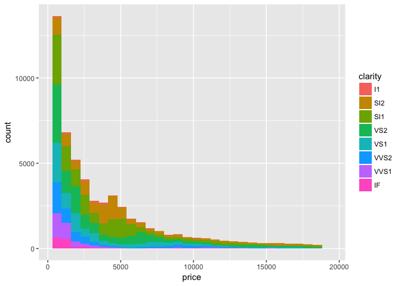<!-- -->

```r
p + geom_histogram(aes(y = ..density..))
```

```
## `stat_bin()` using `bins = 30`. Pick better value with `binwidth`.
```

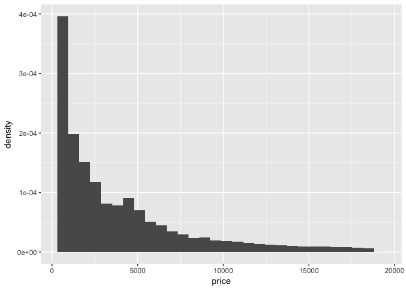<!-- -->


## Setting vs mapping 

```r
p <- ggplot(diamonds, aes(x=carat,y=price))
```
## What will this do?

```r
p + geom_point(aes(colour = "green"))
```

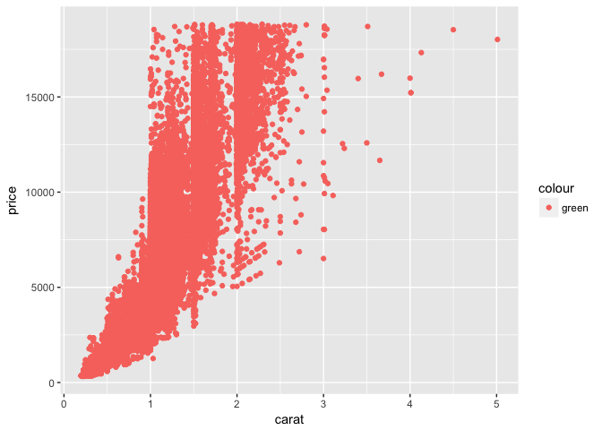<!-- -->

```r
p + geom_point(colour = "green")
```

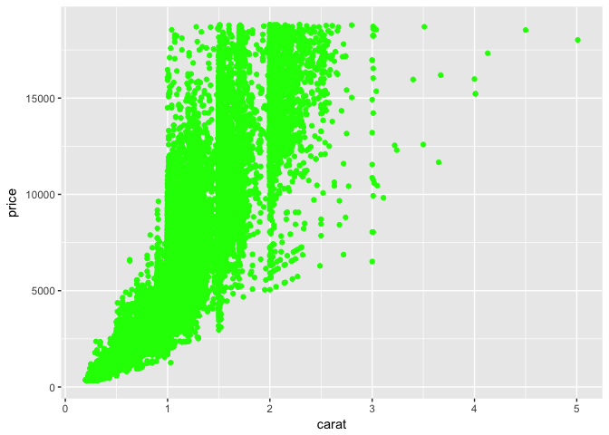<!-- -->


